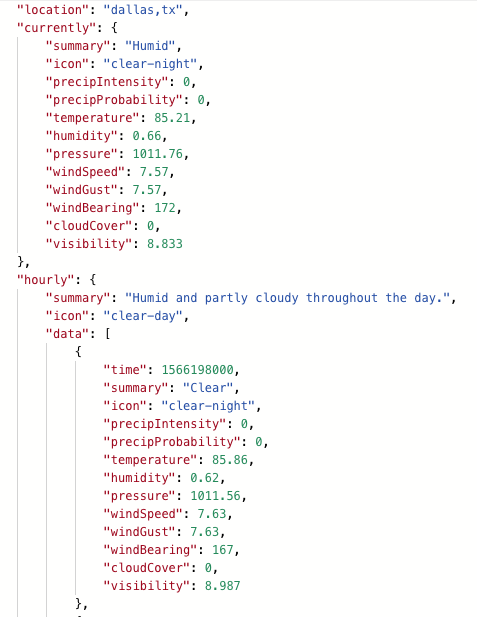
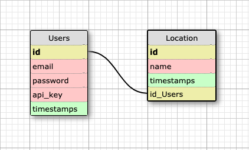

## Introduction

Express Sweater Weather is a solo project that was created as part of The Turing
 School of Software and Design's Backend Engineering Program.  The application
 provides a JavaScript backend for serving API endpoints related to weather.  
The program allows a user to register for an account and log into that account.  
Registered users can then obtain the weather for a city, and also create a list
of their favorite cities.

The learning goals of the project are to gain familiarity with a JavaScript
backend, learn about Node and Express, and learn about testing in JavaScript.

The production version of the application is located at
https://agile-taiga-54337.herokuapp.com/

## Initial Setup

Clone this repository to your computer.
In the terminal, run the following commands:
`npx sequelize db:migrate`
`npx sequelize db:seed:all`

To run the test suite, run the command:
`npm test`

## How To Use

### Account Creation

A user can create an account by making a POST request to:
```
/api/v1/users
Content-Type: application/json
Accept: application/json
```
The user should include their email, password and password confirmation
in the body of the request.

A successful request will return a 201 status code and an API key for
that user.

### User Login

A registered user can log into their account by making a POST request to:
```
/api/v1/sessions
Content-Type: application/json
Accept: application/json
```
In the body of the request the user should include their email and password.

A successful request will return a 200 status code and the API key for
that user.

### Forecast

A registered use can obtain the forecast for a city by making a GET request to:
```
/api/v1/forecast?location=city,state
Content-Type: application/json
Accept: application/json
```
In the body of the request the user should include their API key.

A successful request will return a 200 status code and the weather for that
city.  The JSON response will be broken down into several sections: current
weather, hourly weather for the next eight hours, and daily weather for the
next eight days.

A sample screenshot of the weather forecast is shown below.



### Favorites

A registerer user can have a list of favorite cities.  To add a city to the list
the user should make a POST request to:
```
/api/v1/favorites
Content-Type: application/json
Accept: application/json
```
In the body of the request the user should include the favorite city and their
API key.

A successful request will return a 200 status code and the JSON response
"message": "city/state has been added to your favorites"

## Tech Stack

This application was built using Node and Express, with a Postgres database.
Jest was used for testing.

* Node 10.16.2
* Postgres 11.1
* Express 4.16.4

The schema for the database is shown in the figure below



## How to Contribute

If you would desire to contribute to the project, fork the project from the
master branch.  You can then make the changes you think are appropriate and
submit a pull request.  Please provide a detailed explanation in the pull
request of what the problem or fix is.  

## Core Contributor

This was a solo project.  You can reach the author at their Github link:
Earl Stephens: [https://github.com/earl-stephens]
